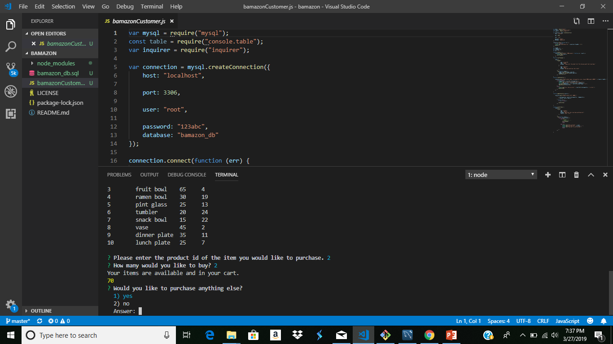
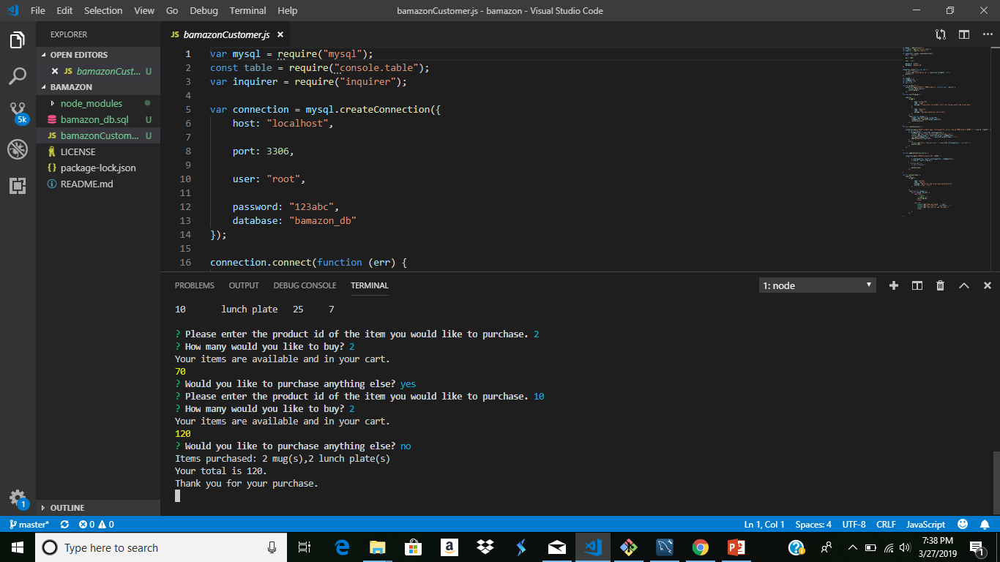

# bamazon
Node application that utilizes inquirer.js to prompt a user to select items that are stored in a mySQL database. Inventory is updated in mySQL as items are selected by the user. 

The following are screenshots of the application in action

